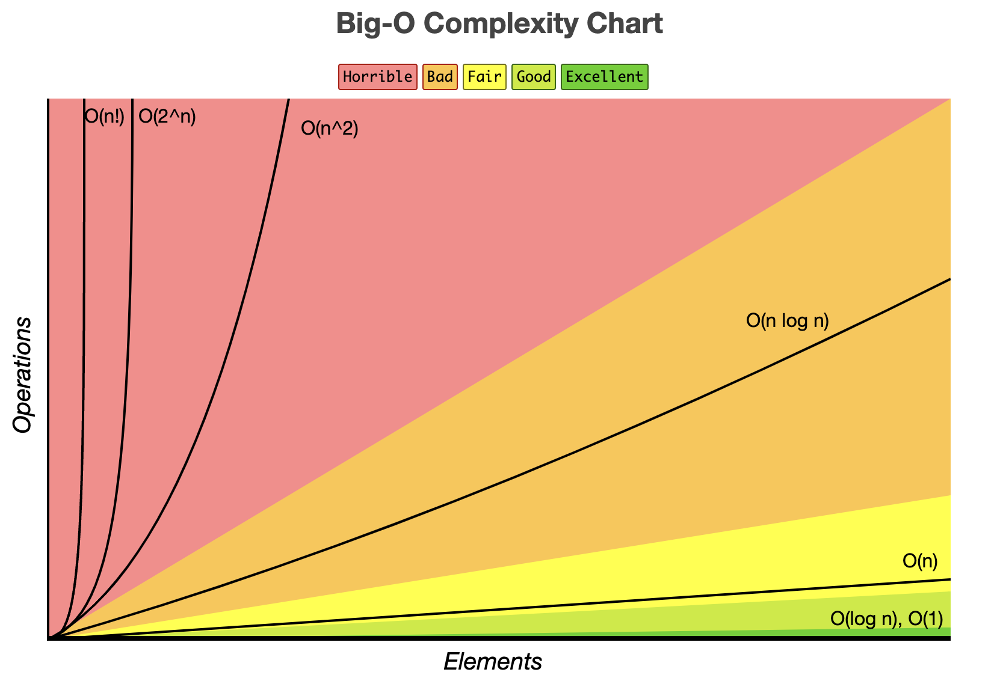
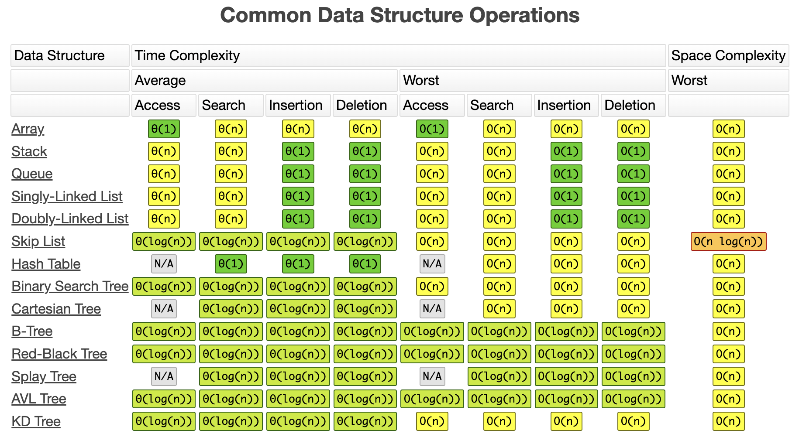

# LeetCode

## Table of Contents

1. [Big O Notation and Time Complexity](#Big-O-Notation-and-Time-Complexity)
- [Linear Time](#Linear-Time)
- [Constant Time](#Constant-Time)

## 1. Big O Notation and Time Complexity
[Big O Cheat Sheet](https://www.bigocheatsheet.com/)
|                                       |                                       |
| ------------------------------------- | ------------------------------------- |
|  |  |
### Linear Time
**O(n)**<br>
```
int addUp(int n){
    int sum = 0;
    for(int i = 0; i <= n; i++) {
        sum += 1;
    }
    return sum;
}
```
n = 1000<br>
1000 steps<br>

### Constant Time
**O(1)**<br>
```
int addUp (int n){
    int sum = n * (p + 1) / 2;
    return sum;
}
```
n = 1000<br>
3 steps<br>

<!-- **Training Set:** The model learns patterns and relationships within the training set. It is the data on which the model is trained to make predictions.<br> -->